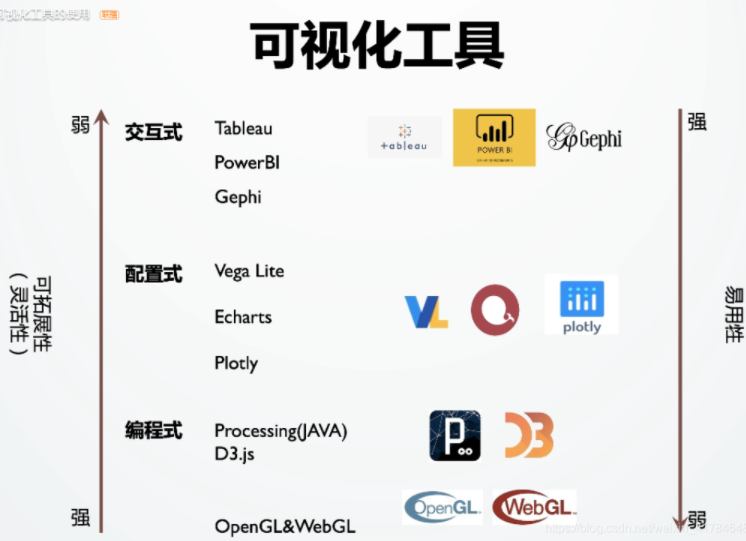
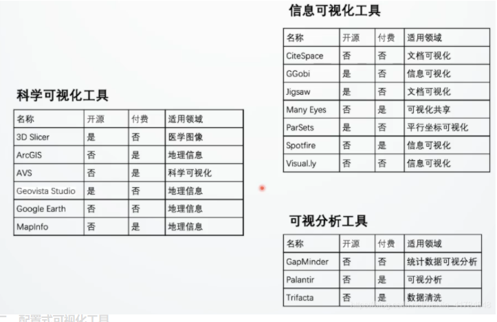

​	可视化使用工具根据其使用的可拓展性（即灵活性）可分为三类：交互式可视化工具、配置式可视化工具、编程式可视化工具。其中他们的可拓展性依次递增，编程式可视化工具可拓展性最好，但同时由于：交互式可视化工具可能仅需要用户掌握软件使用方法；配置式可视化工具需要使用人员具有一定基础编程能力；编程式可视化工具更是需要使用者熟练掌握相应的编程语言。故这三类可视化工具的使用难度也依次递增。其详细信息如下：



#### 一、交互式可视化工具，以Power BI & Tableau为例，一般为商业性软件，可方便的绘制图表


  tableau:商业智能软件，适用于商业报表、数据分析等场景。可以提供简单的图表的创建。

  将分析和构建可视化图表的过程分为了以下五步:

  连接数据源------>构建可视化视图--------->创建工作表-------->构建仪表盘-------->数据故事

   一般交互式可视化工具它适用于如用户缺少编程基础、数据是简单的数据、任务需求比较简单和直接，只需要对数据集进行一个简单的了解这类应用场景，以下是一些适用于不同场景的交互式可视化工具：



#### 二、配置式可视化工具

​      例如：Vega Lite、Echarts、Plotly,一般是通过用户传入特定的配置选项来完成既定的可视化形式。其中配置式一般是指用json对象来完成可视化的配置。

```js
//  Vega-Lite：在2016年的Infovis上，华盛顿大学的交互实验室在发表的一篇文章中定义了一种交互式的可视化语法Vega Lite。
{
    "data":{"url":"data/cars.json"},
    "mark":"circle",
    "select"：{
        "id":{"type":"point","on":"mouseover"}
    },
    "encoding":{
         "x":{"field":"horsepower","type":"quantitative"},
         "y":{"field":"Miles_per_Gallon","type":"quantitative"},
         "color":[
                {"if":"id","value":"orange"}
                {"value":"steeblue"}
            ]
    }
}   
```


​    到目前为止，Vega-Lite已支持条形图、散点图、河流图、折线图、地图等多种图形，网址：https://vega.github.io/vega-lite/.

echarts :由百度开发的基于js的图表库，可解决一些简单的可是分析需求。（详情请查询echarts官网配置项手册）

与Vega-Lite的不同之处在于，除了一般的二维平面可视化，他还提供了三维的可视化版本称为Echarts GL。

总结：相比于交互式可视化工具，配置式可视化工具适用于稍加复杂的场景，一般要求：

1. 用户：对编程有所了解。
2. 数据：简单。 
3. 任务/需求：中等复杂度，交互任务较多。往往可结合编程可视化工具来完成更加复杂的任务。

除上述配置式可视化工具，现有的配置式可视化工具还有：由蚂蚁金服推出的国产可视化工具ANTV；由Uber官方推出的DECK.GL主要是面向城市数据、地理空间数据、三维可视化；PLOT.LY类似于echarts也是利用配置项来配制出具有交互的可视化图表，主要提供了面向python和R语言的可视化相关组件库，所以受众十分广；P4专门用于高性能可视化的一款工具，利用GPU的硬件进行加速，所以他能进行大规模的数据可视化，可以适用不同复杂的可视化场景。

#### 三、编程式可视化工具

Processing：特性：

1. 基于Java和JVM，跨平台。
2. 语言简单易上手，配套开发工具。
3. 集成了OpenGL,利用硬件加速。
4. 用户社区的卓越贡献。2001年诞生于麻省理工的媒体实验室，诞生之初的主要目的是通过激励性的可视化反馈来帮助非程序员的入门编程的学习。在其社区的推动下逐渐演变成了一个媒体媒体表达的一个语言 。

D3：在2011年斯坦福大学发表的论文中提出的Data-Driven Documents，是目前使用率较高的编程式可视化工具。相对于Processing，D3更贴近于可视化的编程，在D3他们的工作里面提出了一种数据驱动的文档的理念。它把数据和可视化元素绑定起来。当有新的元素进入的时候/有旧的元素退出的时候可视化元素就会进行相应的更新来保持数据和展现的一致。

 编程式可视化工具总结:适用于更加复杂的可视化场景，其要求：

1. 用户：编程能力强。
2. 任务/需求：难度高，复杂。
3. 数据：复杂。其他适用于不同场景编程式可视化工具：p5*JS、VTK基于OpenGL、PixiJS、Tulip。


#### **参考资料：**浙江大学2020年暑期可视化课程