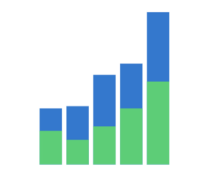
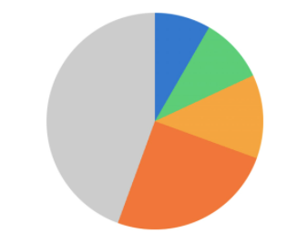
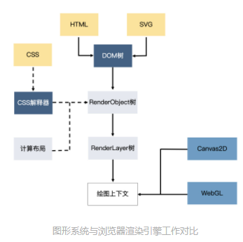

### 01 | 浏览器中实现可视化的四种方式

​	可视化用一句话来说，本质上就是将数据信息组织起来后，以图形的方式呈现出来。在 Web 上，图形通常是通过浏览器绘制的。现代浏览器是一个复杂的系统，其中负责绘制图形的部分是渲染引擎。渲染引擎绘制图形的方式，我总结了一下，大体上有 4 种。

1. 传统的 HTML+CSS。这种方式通常用来呈现普通的 Web 网页。
2. 使用 SVG。SVG 和传统的 HTML+CSS 的绘图方式差别不大。只不过，HTML 元素在绘制矢量图形方面的能力有些不足（我们后面会讲到），而 SVG 恰好弥补了这方面的缺陷。
3. 使用 Canvas2D。这是浏览器提供的 Canvas API 中的其中一种上下文，使用它可以非常方便地绘制出基础的几何图形。在可视化中，Canvas 比较常用，下一节课我们会学习它的基本用法。
4. 使用 WebGL。这是浏览器提供的 Canvas API 中的另一种上下文，它是 OpenGL ES 规范在 Web 端的实现。我们可以通过它，用 GPU 渲染各种复杂的 2D 和 3D 图形。值得一提的是，WebGL 利用了 GPU 并行处理的特性，这让它在处理大量数据展现的时候，性能大大优于前 3 种绘图方式。因此，在可视化的应用中，一些数据量大、视觉效果要求高的特殊场景，使用 WebGL 渲染是一种比较合适的选择。

#### 方式一：HTML+CSS

​	现代浏览器的 HTML、CSS 表现能力很强大，完全可以实现常规的图表展现，比如，我们常见的柱状图、饼图和折线图。

​	虽然我们后面的课程会主要使用 Canvas 和 WebGL 绘图，少数会涉及部分 CSS。但是，你可不要觉得它不重要。为啥呢？理由有两个：

- 一些简单的可视化图表，用 CSS 来实现很有好处，既能简化开发，又不需要引入额外的库，可以节省资源，提高网页打开的速度。
- 理解 CSS 的绘图思想对于可视化也是很有帮助的，比如，CSS 的很多理论就和视觉相关，可视化中都可以拿来借鉴。

1. **HTML 与 CSS 是如何实现可视化的？**

   ​	用 CSS 实现柱状图其实很简单，原理就是使用网格布局（Grid Layout）加上线性渐变（Linear-gradient），我就不多说了，你可以直接看我这里给出的 CSS 代码。

   ```js
   /**
      dataset = {
        current: [15, 11, 17, 25, 37],
        total: [25, 26, 40, 45, 68],
      }
    */
   .bargraph {
     display: grid;
     width: 150px;
     height: 100px;
     padding: 10px;
     transform: scaleY(3);
     grid-template-columns: repeat(5, 20%);
   }
   .bargraph div {
     margin: 0 2px;
   }
   .bargraph div:nth-child(1) {
    background: linear-gradient(to bottom, transparent 75%, #37c 0, #37c 85%, #3c7 0);
   }
   .bargraph div:nth-child(2) {
    background: linear-gradient(to bottom, transparent 74%, #37c 0, #37c 89%, #3c7 0);
   }
   .bargraph div:nth-child(3) {
    background: linear-gradient(to bottom, transparent 60%, #37c 0, #37c 83%, #3c7 0);
   }
   .bargraph div:nth-child(4) {
    background: linear-gradient(to bottom, transparent 55%, #37c 0, #37c 75%, #3c7 0);
   }
   .bargraph div:nth-child(5) {
    background: linear-gradient(to bottom, transparent 32%, #37c 0, #37c 63%, #3c7 0);
   }
   ```

   

   要实现饼图，我们可以使用圆锥渐变，方法也很简单，你直接看代码就可以理解。

   ```css
   .piegraph {
     display: inline-block;
     width: 250px;
     height: 250px;
     border-radius: 50%;
     background-image: conic-gradient(#37c 30deg, #3c7 30deg, #3c7 65deg, orange 65deg, orange 110deg, #f73 110deg, #f73 200deg, #ccc 200deg);
   }
   ```

   

   用 HTML 和 CSS 也可以实现折线图。可以用高度很小的 Div 元素来模拟线段，然后用 transform 改变角度和位置，这样就能拼成折线图了。 另外，如果使用 clip-path 这样的高级属性，我们还能实现更复杂的图表，比如，用不同的颜色表示两个不同折线的面积。

   

   实际上很多常见的可视化图表我们都可以用 HTML 和 CSS 来实现，不需要用其他的绘图方式。但是，为什么在可视化领域很少有人直接用 HTML 和 CSS 来绘制图表呢？这主要是因为，使用 HTML 和 CSS 绘图，有 2 个缺点。

2. **用 HTML+CSS 实现可视化的缺点**

   1. 首先，HTML 和 CSS 主要还是为网页布局而创造的，使用它们虽然能绘制可视化图表，但是绘制的方式并不简洁。这是因为，从 CSS 代码里，我们很难看出数据与图形的对应关系，有很多换算也需要开发人员自己来做。这样一来，**一旦图表或数据发生改动，就需要我们重新计算，维护起来会很麻烦**。
   2. 其次，HTML 和 CSS 作为浏览器渲染引擎的一部分，为了完成页面渲染的工作，除了绘制图形外，还要做很多额外的工作。比如说，浏览器的渲染引擎在工作时，要先解析 HTML、SVG、CSS，构建 DOM 树、RenderObject 树和 RenderLayer 树，然后用 HTML（或 SVG）绘图。当图形发生变化时，我们很可能要重新执行全部的工作，这样的**性能开销是非常大**的。

   传统的 Web 开发，因为涉及 UI 构建和内容组织，所以这些额外的解析和构建工作都是必须做的。而可视化与传统网页不同，它不太需要复杂的布局，更多的工作是在绘图和数据计算。所以，对于可视化来说，这些额外的工作反而相当于白白**消耗了性能**。

   **因此，相比于 HTML 和 CSS，Canvas2D 和 WebGL 更适合去做可视化这一领域的绘图工作。它们的绘图 API 能够直接操作绘图上下文，一般不涉及引擎的其他部分，在重绘图像时，也不会发生重新解析文档和构建结构的过程，开销要小很多。**

   

#### 方式二：SVG

​	现代浏览器支持 SVG（Scalable Vector Graphics，可缩放矢量图），SVG 是一种基于 XML 语法的图像格式，可以用图片（img 元素）的 src 属性加载。而且，浏览器更强大的是，它还可以内嵌 SVG 标签，并且像操作普通的 HTML 元素一样，利用 DOM API 操作 SVG 元素。甚至，CSS 也可以作用于内嵌的 SVG 元素。

**SVG实现柱状图：**

```css
 <!--
      dataset = {
        total: [25, 26, 40, 45, 68],
        current: [15, 11, 17, 25, 37],
      }
  -->
  <svg xmlns="http://www.w3.org/2000/svg" width="120px" height="240px" viewBox="0 0 60 100">
    <g transform="translate(0, 100) scale(1, -1)">
      <g>
        <rect x="1" y="0" width="10" height="25" fill="#37c"/>
        <rect x="13" y="0" width="10" height="26" fill="#37c"/>
        <rect x="25" y="0" width="10" height="40" fill="#37c"/>
        <rect x="37" y="0" width="10" height="45" fill="#37c"/>
        <rect x="49" y="0" width="10" height="68" fill="#37c"/>
      </g>
      <g>
        <rect x="1" y="0" width="10" height="15" fill="#3c7"/>
        <rect x="13" y="0" width="10" height="11" fill="#3c7"/>
        <rect x="25" y="0" width="10" height="17" fill="#3c7"/>
        <rect x="37" y="0" width="10" height="25" fill="#3c7"/>
        <rect x="49" y="0" width="10" height="37" fill="#3c7"/>
      </g>
    </g>
  </svg>
```

从上面的 SVG 代码中，我们可以一目了然地看出，数据 total 和 current 分别对应 SVG 中两个 g 元素下的 rect 元素的高度。也就是说，元素的属性和数值可以直接对应起来。而 CSS 代码并不能直观体现出数据的数值，需要进行 CSS 规则转换。

在上面这段 SVG 代码中，g 表示分组，rect 表示绘制一个矩形元素。除了 rect 外，SVG 还提供了丰富的图形元素，可以绘制矩形、圆弧、椭圆、多边形和贝塞尔曲线等等。

**HTML 的不足之处在于 HTML 元素的形状一般是矩形**，虽然用 CSS 辅助，也能够绘制出各种其它形状的图形，甚至不规则图形，但是总体而言还是非常麻烦的。而 SVG 则弥补了这方面的不足，让不规则图形的绘制变得更简单了。因此，用 SVG 绘图比用 HTML 和 CSS 要便利得多。

**SVG 图表也有缺点。**在渲染引擎中，SVG 元素和 HTML 元素一样，在输出图形前都需要经过引擎的解析、布局计算和渲染树生成。而且，一个 SVG 元素只表示一种基本图形，如果展示的数据很复杂，生成图形的 SVG 元素就会很多。这样一来，大量的 SVG 元素不仅会占用很多内存空间，还会增加引擎、布局计算和渲染树生成的开销，降低性能，减慢渲染速度。这也就注定了 SVG 只适合应用于元素较少的简单可视化场景。

#### 方式三：Canvas2D

​	无论是使用 HTML/CSS 还是 SVG，它们都属于**声明式绘图系统**，也就是我们根据数据创建各种不同的图形元素（或者 CSS 规则），然后利用浏览器渲染引擎解析它们并渲染出来。但是 Canvas2D 不同，它是浏览器提供的一种可以直接用代码在一块平面的“画布”上绘制图形的 API，使用它来绘图更像是传统的“编写代码”，简单来说就是调用绘图指令，然后引擎直接在页面上绘制图形。这是一种**指令式的绘图系统**。

​	总结来说，Canvas 能够直接**操作绘图上下文**，**不需要经过 HTML**、**CSS 解析**、**构建渲染树**、**布局**等一系列操作。因此单纯绘图的话，Canvas 比 HTML/CSS 和 SVG 要快得多。

​	但是，因为 HTML 和 SVG 一个元素对应一个基本图形，所以我们可以很方便地操作它们，比如在柱状图的某个柱子上注册点击事件。而同样的功能在 Canvas 上就比较难实现了，因为对于 Canvas 来说，绘制整个柱状图的过程就是一系列指令的执行过程，其中并没有区分“A 柱子”、“B 柱子”，这让我们很难单独对 Canvas 绘图的局部进行控制。不过，这并不代表我们就不能控制 Canvas 的局部了。实际上，通过数学计算我们是可以通过定位的方式来获取局部图形的，在后续的课程中我们会解决这个问题。

​	有一点需要你注意，Canvas 和 SVG 的使用也不是非此即彼的，它们可以结合使用。因为 SVG 作为一种图形格式，也可以作为 image 元素绘制到 Canvas 中。举个例子，我们可以先使用 SVG 生成某些图形，然后用 Canvas 来渲染。这样，我们就既可以享受 SVG 的便利性，又可以享受 Canvas 的高性能了。

#### 方式四：WebGL

​	一般情况下，Canvas2D 绘制图形的性能已经足够高了，但是在三种情况下我们有必要直接操作更强大的 GPU 来实现绘图。

1. 如果我们**要绘制的图形数量非常多**，比如有多达数万个几何图形需要绘制，而且它们的位置和方向都在不停地变化，那我们即使用 Canvas2D 绘制了，性能还是会达到瓶颈。这个时候，我们就需要使用 GPU 能力，直接用 WebGL 来绘制。
2. 如果我们**要对较大图像的细节做像素处理**，比如，实现物体的光影、流体效果和一些复杂的像素滤镜。由于这些效果往往要精准地改变一个图像全局或局部区域的所有像素点，要计算的像素点数量非常的多（一般是数十万甚至上百万数量级的）。这时，即使采用 Canvas2D 操作，也会达到性能瓶颈，所以我们也要用 WebGL 来绘制。
3. **绘制 3D 物体**。因为 WebGL 内置了对 3D 物体的投影、深度检测等特性，所以用它来渲染 3D 物体就不需要我们自己对坐标做底层的处理了。那在这种情况下，WebGL 无论是在使用上还是性能上都有很大优势。

#### 总结：

1. HTML+CSS 的优点是方便，不需要第三方依赖，甚至不需要 JavaScript 代码。缺点是 CSS 属性不能直观体现数据，绘制起来也相对麻烦，图形复杂会导致 HTML 元素多，而消耗性能。
2. SVG 是对 HTML/CSS 的增强，弥补了 HTML 绘制不规则图形的能力。它通过属性设置图形，可以直观地体现数据，使用起来非常方便。但是 SVG 也有和 HTML/CSS 同样的问题，图形复杂时需要的 SVG 元素太多，也非常消耗性能。
3. Canvas2D 是浏览器提供的简便快捷的指令式图形系统，它通过一些简单的指令就能快速绘制出复杂的图形。由于它直接操作绘图上下文，因此没有 HTML/CSS 和 SVG 绘图因为元素多导致消耗性能的问题，性能要比前两者快得多。但是如果要绘制的图形太多，或者处理大量的像素计算时，Canvas2D 依然会遇到性能瓶颈。
4. WebGL 是浏览器提供的功能强大的绘图系统，它使用比较复杂，但是功能强大，能够充分利用 GPU 并行计算的能力，来快速、精准地操作图像的像素，在同一时间完成数十万或数百万次计算。另外，它还内置了对 3D 物体的投影、深度检测等处理，这让它更适合绘制 3D 场景。

